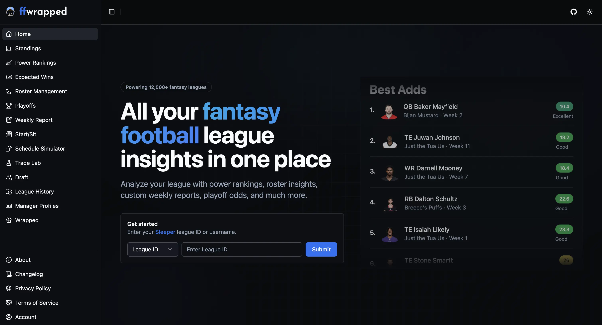

# Fantasy Football Wrapped

Fantasy Football Wrapped ([ffwrapped](https://ffwrapped.com/)) is a production Vue/TypeScript app used by thousands of fantasy football managers to analyze Sleeper and ESPN leagues. The app transforms league, roster, matchup, draft, and transaction data into power rankings, playoff odds, AI-generated reports, trade insights, and personalized season recaps.



## Current Features

- Comprehensive standings and AI-generated league news/current trends
- Power rankings, roster rankings, and projections
- Expected wins, strength of schedule (measuring luck), and schedule analysis
- Roster management stats, trade rankings, and waiver wire moves
- Playoff odds
- AI-generated weekly reports, summaries of matchups, and top/bottom performers from each week
- Weekly matchup previews
- Start/sit stats with latest player news
- Draft grades and recap
- Schedule simulator and trade calculator
- Manager profiles highlighting tendencies, strengths, and overall identity
- League history stats
- Yearly Spotify Wrapped-style presentation

## Contributing

### Project Structure

```text
src/
  api/          API clients and data transforms
  components/   Feature and shared UI components
  composables/  Reusable view logic
  lib/          App utilities, auth helpers, and integrations
  store/        Pinia stores
  types/        Shared TypeScript types
  views/        Route-level pages

test/           Vitest coverage
```

### Getting started

Fork this repository and then clone the fork. To run the project locally, you'll need Node.js and npm installed.

```bash
  git clone https://github.com/kt474/fantasy-football-wrapped.git
  cd fantasy-football-wrapped
  npm install
  npm run dev
```

No environment variables are required to run the project locally, though some features such as AI-generated summaries are hidden behind an API.

### Technologies

- Frontend: Vue 3, TypeScript, Vite
- State management: Pinia
- UI: Tailwind CSS, shadcn-vue
- Backend integrations: Node.js, Supabase, Stripe, Resend, OpenAI
- Analytics: PostHog, Umami
- Testing: Vitest
- Deployment: Vercel

### Pull Request Process

1. Look through the open issues and find one you would like to work on (or create your own issues!)
2. Create a new branch for your feature/fix
3. Make your changes
4. Submit a pull request

## Acknowledgements

- [Sleeper API](https://docs.sleeper.com/)
- [Avatars](https://getavataaars.com/)
- [Icon](https://www.flaticon.com/free-icons/american-football)

## Contact

Please report any issues or request new features in the [issues](https://github.com/kt474/fantasy-football-wrapped/issues) tab
